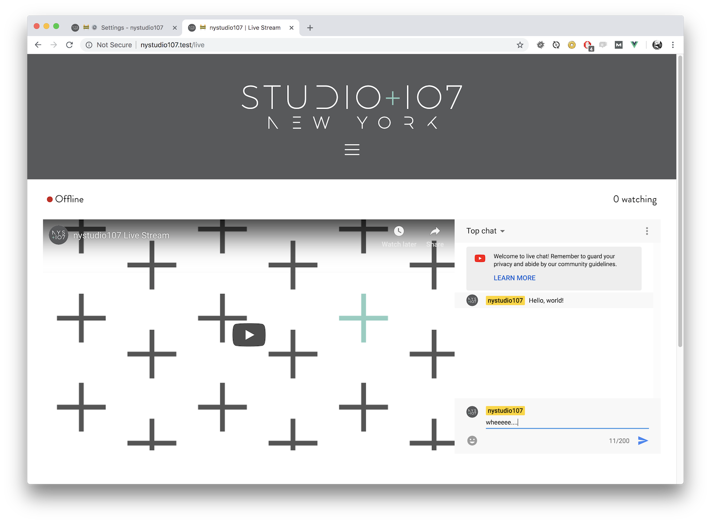

[](https://scrutinizer-ci.com/g/nystudio107/craft-youtubeliveembed/?branch=v1) [](https://scrutinizer-ci.com/g/nystudio107/craft-youtubeliveembed/?branch=v1) [](https://scrutinizer-ci.com/g/nystudio107/craft-youtubeliveembed/build-status/v1) [](https://scrutinizer-ci.com/code-intelligence)

# YouTube Live Embed plugin for Craft CMS 3.x

This plugin allows you to embed a YouTube live stream and/or live chat on your webpage


## Requirements

This plugin requires Craft CMS 3.0.0-beta.23 or later.

## Installation

To install the plugin, follow these instructions.

1. Open your terminal and go to your Craft project:

        cd /path/to/project

2. Then tell Composer to load the plugin:

        composer require nystudio107/craft-youtubeliveembed

3. In the Control Panel, go to Settings → Plugins and click the “Install” button for YouTube Live Embed.

You can also install Webperf via the **Plugin Store** in the Craft Control Panel.

## YouTube Live Embed Overview

YouTube Live Embed allows you to embed a YouTube live stream and/or live chat on your webpage.

You can also use it to determine whether a stream is currently live, and how many people are currently viewing the live stream.

Both the live stream and the live stream chat are embedded as responsive `<iframe>` elements, that you can control the aspect ratio of should you so wish.



## Configuring YouTube Live Embed

The only configuration is the **YouTube Channel ID** in the plugin settings. If you do not know your YouTube Channel ID, [here is how to find it](https://support.google.com/youtube/answer/3250431?hl=en).

You can also override this setting in the `config.php` or at runtime via Twig, should you need to (see below).

## Using YouTube Live Embed

### Embedding a Live Stream Video

To embed a live stream video, simply do:

```twig
    {{ craft.youtubelive.embedStream() }}
```

This will embed a responsive `<iframe>` element with a fixed aspect ratio that grows to fill its parent container.

The default aspect ratio is **16:9** but you can also optionally change it via:

```twig
    {{ craft.youtubelive.embedStream(ASPECT_RATIO_X, ASPECT_RATIO_Y) }}
```

If you have a Google AMP page, you can use:

```twig
    {{ craft.youtubelive.embedStreamAmp() }}
```

### Embedding a Live Stream Chat

To embed a live stream chat, simply do:

```twig
    {{ craft.youtubelive.embedChat() }}
```

This will embed a responsive `<iframe>` element with a fixed aspect ratio that grows to fill its parent container.

The default aspect ratio is **16:9** but you can also optionally change it via:

```twig
    {{ craft.youtubelive.embedChat(ASPECT_RATIO_X, ASPECT_RATIO_Y) }}
```

If you have a Google AMP page, you can use:

```twig
    {{ craft.youtubelive.embedChatAmp() }}
```

### Changing the Channel ID

By default, the YouTube Channel ID you specify in the plugin's settings will be used, but you can also change it dynamically via:

```twig
    
```

This could be useful if you had a website where you had more than one streaming channel to contend with.

If you do not know your YouTube Channel ID, [here is how to find it](https://support.google.com/youtube/answer/3250431?hl=en).

### Determining if the Stream is Live

To determine if the YouTube Video Stream is live, you can do:

```twig
    
    
```

### Determining the Number of Live Viewers

To determine the number of viewers watching the live YouTube Video Stream, you can do:

```twig
    
```

## YouTube Live Embed Roadmap

Some things to do, and ideas for potential features:

* Release it

Brought to you by [nystudio107](https://nystudio107.com)
